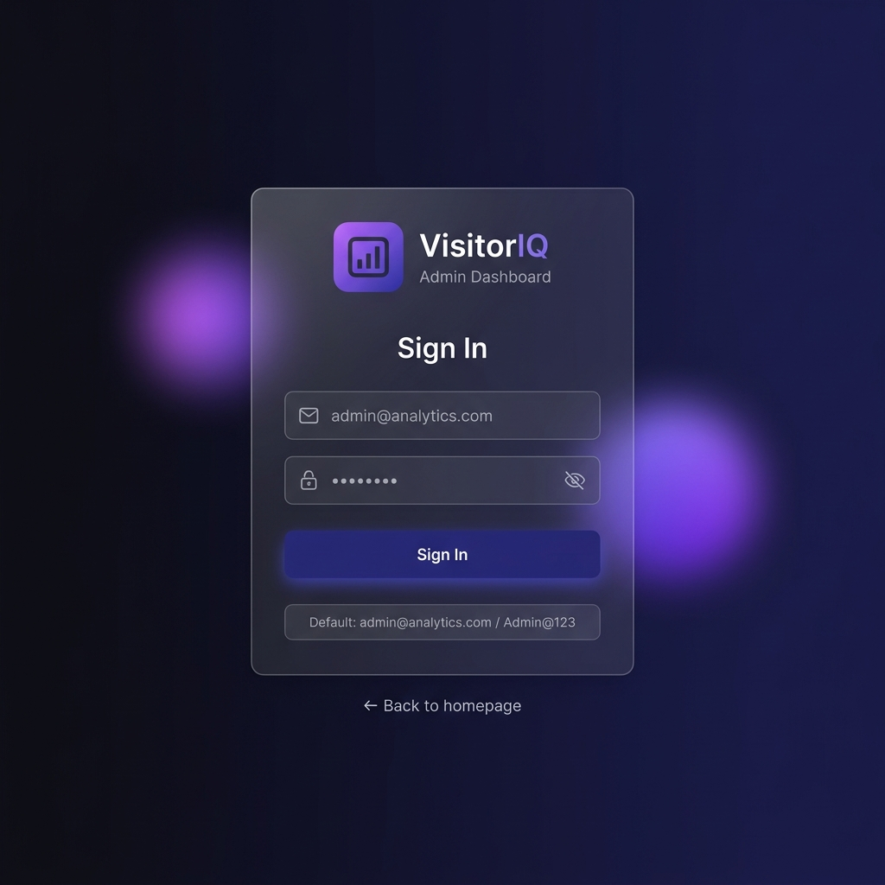
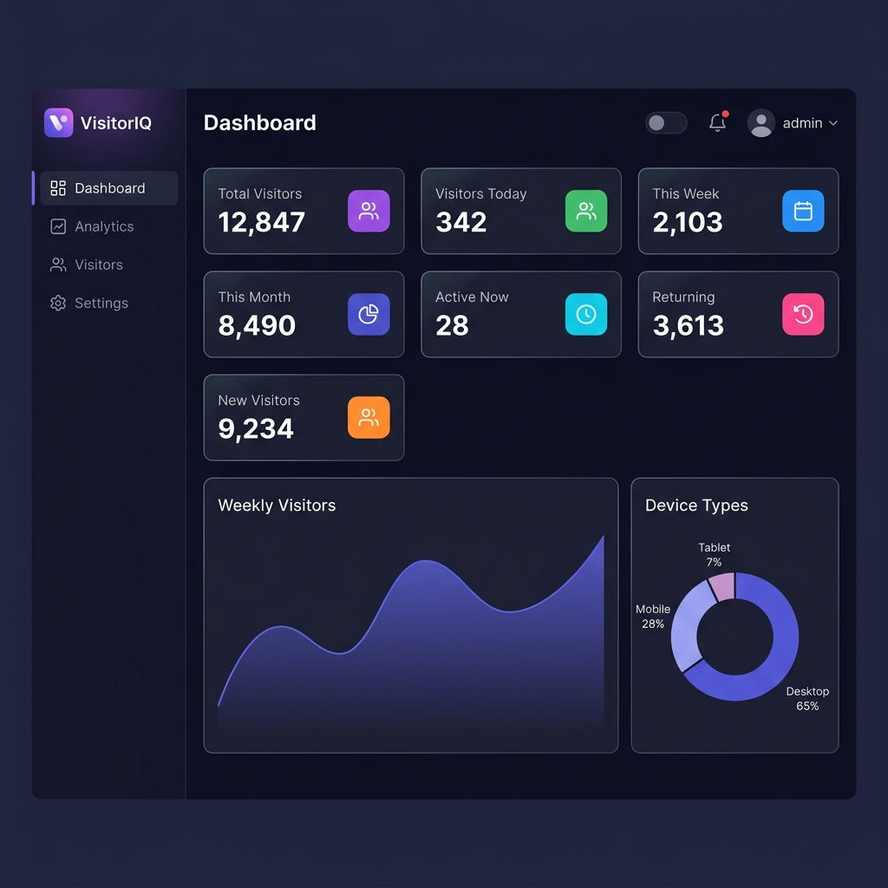
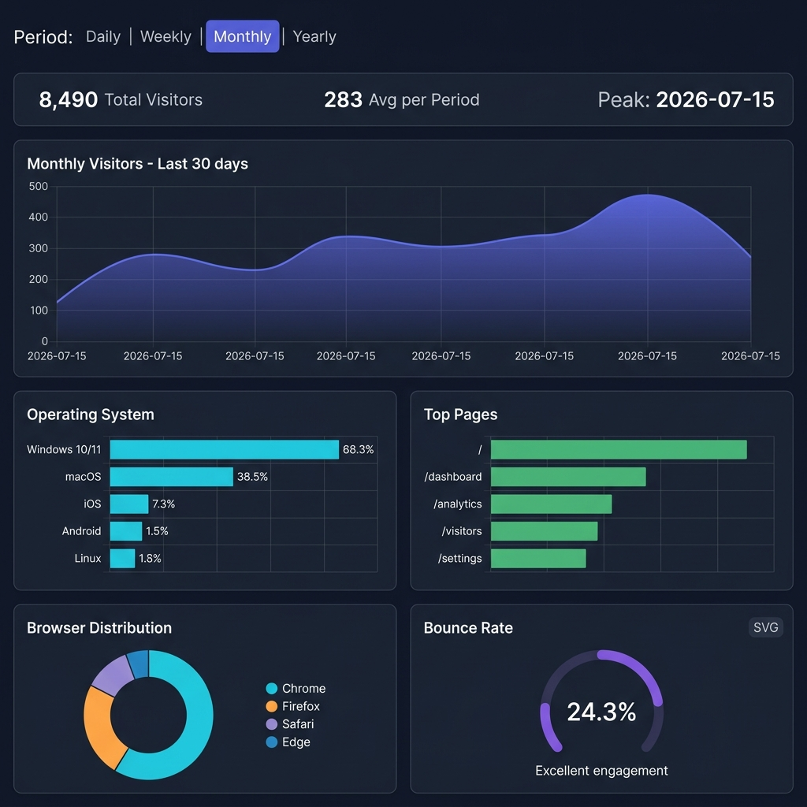
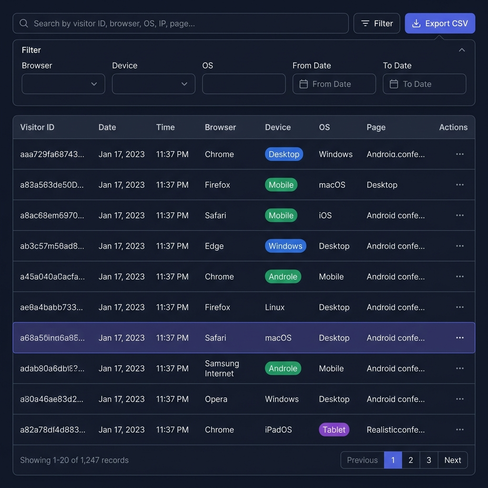

<div align="center">

# 📊 VisitorIQ — Visitor Analytics Dashboard

**A powerful, self-hosted, full-stack website visitor analytics platform.**
Track every visitor automatically. Gain deep insights. Own your data — forever.

[](https://nodejs.org)
[](https://react.dev)
[](https://mongodb.com)
[](https://tailwindcss.com)
[](LICENSE)

[🚀 Quick Start](#-quick-start) · [✨ Features](#-features) · [📡 API Reference](#-rest-api-reference) · [🏗️ Architecture](#-architecture) · [🔧 Troubleshooting](#-troubleshooting)

</div>

---

## 🖼️ Screenshots

### 🏠 Landing Page


---

### 🔐 Admin Login


---

### 📊 Dashboard Overview


---

### 📈 Analytics & Reports


---

### 🗂️ Visitor Logs Table


---

## 🌟 Overview

**VisitorIQ** is a complete, production-ready visitor analytics system built entirely with open-source technologies. Every time a user opens your website, their visit is automatically recorded — browser, OS, device type, screen resolution, timezone, language, referrer, IP address, and more — then visualized in a beautiful admin dashboard.

> **No Docker. No paid services. No third-party tracking. 100% self-hosted.**

---

## ✨ Features

### 🔍 Automatic Visitor Tracking
Every page load is silently captured without any user action required.

| Data Point | Description |
|---|---|
| Visitor ID | Persistent UUID stored in localStorage |
| Session ID | Per-tab UUID stored in sessionStorage |
| Browser | Chrome, Firefox, Safari, Edge, Opera, etc. |
| Operating System | Windows, macOS, Linux, iOS, Android, etc. |
| Device Type | Desktop / Mobile / Tablet |
| Screen Resolution | e.g. `1920x1080` |
| Language | Browser language preference |
| Timezone | IANA timezone string |
| Page | Current URL path |
| Referrer | Source URL or "Direct" |
| IP Address | Extracted server-side (proxy-aware) |
| First Visit | Boolean — new vs returning visitor |
| Last Visit | ISO timestamp of most recent visit |

---

### 📊 Analytics Dashboard

#### Summary Cards (7 metrics)
| Card | Description |
|---|---|
| 👥 Total Visitors | All-time unique visitor count |
| 📅 Visitors Today | Count for the current date |
| 📆 This Week | Count for the last 7 days |
| 🗓️ This Month | Count for the last 30 days |
| 🟢 Active Now | Visitors active in the last 15 minutes |
| ✨ New Visitors | First-time visitors |
| 🔁 Returning | Repeat visitors |

#### Charts (8 visualizations)
| Chart | Type | Description |
|---|---|---|
| Weekly Visitors | Area chart | Last 7 days trend |
| Monthly Visitors | Bar chart | Last 30 days |
| Device Types | Donut pie | Desktop / Mobile / Tablet split |
| Browser Usage | Donut pie | Top browsers |
| Peak Hours | Bar chart | 24-hour visitor distribution |
| OS Breakdown | Horizontal bar | Top operating systems |
| Top Pages | Horizontal bar | Most visited URLs |
| Bounce Rate | SVG gauge | Single-session rate |

---

### 🗂️ Visitor Logs Table
- **Search** across Visitor ID, browser, OS, IP, page
- **Filters** by browser, device, OS, date range
- **Sort** by any column (ascending / descending)
- **Pagination** with configurable rows per page (10 / 20 / 50 / 100)
- **View Details** modal with all 15+ data fields
- **Delete** individual records
- **Export CSV** with applied filters

---

### 🔐 Admin Authentication
- JWT-based login with `httpOnly` cookie + Authorization header support
- bcrypt password hashing (10 salt rounds)
- Protected routes — unauthenticated users redirect to `/login`
- Auto-logout on token expiry (401 interceptor)
- Change password + update profile from Settings

---

### 📈 Analytics Reports
- **Daily** — hourly breakdown (00:00–23:00) for today
- **Weekly** — day-by-day totals for last 7 days
- **Monthly** — day-by-day totals for last 30 days
- **Yearly** — month-by-month totals for last 12 months
- **Bounce Rate** — calculated from single-page sessions
- **Peak Traffic Hours** — which hours drive the most visitors

---

### 🎨 UI & UX
- **Dark Mode** — system preference detection + manual toggle, persisted in `localStorage`
- **Collapsible Sidebar** — icon-only mode to maximize content space
- **Toast Notifications** — success/error feedback on all actions
- **Loading Spinners** — on every async operation
- **Responsive Design** — works on desktop, tablet, and mobile
- **Smooth Animations** — fade-in, slide-up, hover transitions

---

## 🏗️ Architecture

```
visitor-analytics/
│
├── 📁 client/                        React + Vite Frontend
│   ├── src/
│   │   ├── context/
│   │   │   ├── AuthContext.jsx       JWT state, login/logout helpers
│   │   │   └── ThemeContext.jsx      Dark/light mode, localStorage sync
│   │   │
│   │   ├── services/
│   │   │   ├── api.js                Axios instance, interceptors, 401 handler
│   │   │   └── visitorTracker.js     Auto-tracking on app mount
│   │   │
│   │   ├── hooks/
│   │   │   ├── useAuth.js            Auth context consumer
│   │   │   ├── useTheme.js           Theme context consumer
│   │   │   ├── useDashboard.js       Stats fetcher, 30s auto-refresh
│   │   │   └── useVisitors.js        Paginated visitor list with filters
│   │   │
│   │   ├── layouts/
│   │   │   └── DashboardLayout.jsx   Sidebar + TopNavbar shell
│   │   │
│   │   ├── components/
│   │   │   ├── Sidebar.jsx           Collapsible nav with active state
│   │   │   ├── TopNavbar.jsx         Dark mode, notifications, avatar
│   │   │   ├── StatCard.jsx          Metric card with icon + color variant
│   │   │   ├── ChartCard.jsx         Recharts wrapper with title/subtitle
│   │   │   ├── VisitorTable.jsx      Full data table with all features
│   │   │   ├── VisitorDetailModal.jsx All-field detail popup
│   │   │   ├── ExportButton.jsx      CSV blob download
│   │   │   ├── ProtectedRoute.jsx    JWT guard, redirect to /login
│   │   │   └── LoadingSpinner.jsx    Size variants + fullscreen overlay
│   │   │
│   │   └── pages/
│   │       ├── LandingPage.jsx       Hero, Features, About, Contact, Footer
│   │       ├── LoginPage.jsx         Email/password form, JWT login
│   │       ├── Dashboard.jsx         Cards + 5 charts
│   │       ├── Analytics.jsx         Period reports + 6 breakdown charts
│   │       ├── VisitorLogs.jsx       Table with search/filters/export
│   │       ├── Settings.jsx          Profile, password, logout
│   │       └── NotFound.jsx          404 error page
│   │
│   ├── tailwind.config.js            Dark mode, custom colors & animations
│   └── package.json
│
└── 📁 server/                        Node.js + Express Backend (MVC)
    ├── config/
    │   └── db.js                     Mongoose connection with retry logic
    │
    ├── models/
    │   ├── Admin.js                  Admin schema, bcrypt pre-save hook
    │   └── Visitor.js                Visitor schema, compound indexes
    │
    ├── controllers/
    │   ├── authController.js         Login, logout, profile, password change
    │   ├── visitorController.js      Record, list, get, delete, export CSV
    │   ├── dashboardController.js    Aggregated stat cards
    │   └── analyticsController.js   Breakdown charts, period reports
    │
    ├── middleware/
    │   ├── auth.js                   JWT verification (Bearer + cookie)
    │   └── errorHandler.js           Centralized error handler + 404
    │
    ├── routes/
    │   ├── authRoutes.js
    │   ├── visitorRoutes.js
    │   ├── dashboardRoutes.js
    │   └── analyticsRoutes.js
    │
    ├── utils/
    │   └── seedAdmin.js              One-time admin account creation
    │
    ├── server.js                     Express app, middleware, route mount
    └── .env                          Environment variables
```

---

## ⚙️ Tech Stack

| Layer | Technology | Version |
|---|---|---|
| **Frontend Framework** | React | 18 |
| **Build Tool** | Vite | 5 |
| **Styling** | Tailwind CSS | 3 |
| **Routing** | React Router | v6 |
| **Charts** | Recharts | 2 |
| **HTTP Client** | Axios | 1.6 |
| **Notifications** | react-hot-toast | 2 |
| **Icons** | react-icons (MD) | 4 |
| **Backend Framework** | Express.js | 4 |
| **Database** | MongoDB + Mongoose | 7 / 8 |
| **Authentication** | JWT + bcryptjs | — |
| **Logging** | Morgan | 1.10 |
| **ID Generation** | uuid | 9 |

---

## 🚦 Prerequisites

Before you begin, ensure you have the following installed:

- **[Node.js](https://nodejs.org) v18 or higher**
- **[MongoDB Community Server](https://www.mongodb.com/try/download/community)** (local installation)

### Starting MongoDB

**macOS with Homebrew:**
```bash
brew install mongodb-community
brew services start mongodb-community
```

**macOS / Linux (manual):**
```bash
mkdir -p /data/db
mongod --dbpath /data/db
```

**Windows:**
```bash
# Run as administrator, replace <version> with your installed version
"C:\Program Files\MongoDB\Server\<version>\bin\mongod.exe" --dbpath C:\data\db
```

> **Verify MongoDB is running:** Open a new terminal and run `mongosh` — if it connects, you're ready.

---

## 🚀 Quick Start

### Step 1 — Navigate to the project

```bash
cd visitor-analytics
```

### Step 2 — Install Backend Dependencies

```bash
cd server
npm install
```

### Step 3 — Configure Environment Variables

The `.env` file is already created at `server/.env`. Review and update as needed:

```env
PORT=5000
MONGO_URI=mongodb://localhost:27017/visitor-analytics
JWT_SECRET=your_super_secret_jwt_key_change_this_in_production
JWT_EXPIRE=7d
NODE_ENV=development
CLIENT_URL=http://localhost:5173
```

> **⚠️ Security Warning:** Change `JWT_SECRET` to a long, random string before deploying to any server. You can generate one with:
> ```bash
> node -e "console.log(require('crypto').randomBytes(64).toString('hex'))"
> ```

### Step 4 — Create the Admin Account *(first time only)*

```bash
# From the server/ directory
node utils/seedAdmin.js
```

Expected output:
```
✅ Connected to MongoDB
✅ Admin account created successfully!
   Email:    admin@analytics.com
   Password: Admin@123

⚠️  Please change your password after first login.
```

### Step 5 — Start the Backend Server

```bash
# From the server/ directory
npm run dev
```

```
🚀 Server running in development mode on port 5000
📡 API: http://localhost:5000/api
✅ MongoDB Connected: localhost
```

### Step 6 — Install & Start the Frontend

Open a **new terminal tab/window**:

```bash
cd client
npm install
npm run dev
```

```
  VITE v5.x.x  ready in 300 ms

  ➜  Local:   http://localhost:5173/
  ➜  Network: use --host to expose
```

### Step 7 — Open the App

Navigate to **[http://localhost:5173](http://localhost:5173)** in your browser.

---

## 🔐 Default Admin Credentials

| Field | Value |
|---|---|
| 📧 Email | `admin@analytics.com` |
| 🔑 Password | `Admin@123` |

> **⚠️ Important:** Change your password immediately after first login via the **Settings** page (`/settings`).

---

## 📡 REST API Reference

All protected endpoints require an `Authorization: Bearer <token>` header (or the `token` httpOnly cookie).

### Authentication

| Method | Endpoint | Auth | Body | Description |
|---|---|---|---|---|
| `POST` | `/api/auth/login` | ✗ Public | `{ email, password }` | Sign in, returns JWT |
| `POST` | `/api/auth/logout` | ✓ Required | — | Clear session cookie |
| `GET` | `/api/auth/me` | ✓ Required | — | Get admin profile |
| `PUT` | `/api/auth/profile` | ✓ Required | `{ name, email }` | Update profile |
| `PUT` | `/api/auth/password` | ✓ Required | `{ currentPassword, newPassword }` | Change password |

### Visitor Tracking

| Method | Endpoint | Auth | Description |
|---|---|---|---|
| `POST` | `/api/visit` | ✗ Public | Record a new visitor visit |
| `GET` | `/api/visitors` | ✓ Required | Paginated visitor list with filters |
| `GET` | `/api/visitor/:id` | ✓ Required | Single visitor full detail |
| `DELETE` | `/api/visitor/:id` | ✓ Required | Delete a visitor record |
| `GET` | `/api/visitors/export` | ✓ Required | Download all visitors as CSV |

**Query Parameters for `GET /api/visitors`:**
```
page        Page number (default: 1)
limit       Records per page (default: 20)
search      Search across ID, browser, OS, IP, page
browser     Filter by browser name (regex)
device      Filter by device: Desktop | Mobile | Tablet
os          Filter by OS (regex)
startDate   YYYY-MM-DD range start
endDate     YYYY-MM-DD range end
sortBy      Field to sort by (default: createdAt)
order       asc | desc (default: desc)
```

### Dashboard & Analytics

| Method | Endpoint | Auth | Description |
|---|---|---|---|
| `GET` | `/api/dashboard` | ✓ Required | All 7 summary stat card values |
| `GET` | `/api/analytics` | ✓ Required | Browser, device, OS, page, peak hour breakdowns + bounce rate |
| `GET` | `/api/analytics/reports/daily` | ✓ Required | Hourly visitor counts for today |
| `GET` | `/api/analytics/reports/weekly` | ✓ Required | Daily counts for last 7 days |
| `GET` | `/api/analytics/reports/monthly` | ✓ Required | Daily counts for last 30 days |
| `GET` | `/api/analytics/reports/yearly` | ✓ Required | Monthly counts for last 12 months |

---

## 🗄️ MongoDB Collections

### `admins`

| Field | Type | Notes |
|---|---|---|
| `name` | String | Required, max 50 chars |
| `email` | String | Unique, lowercase |
| `password` | String | bcrypt hashed, excluded from queries |
| `createdAt` | Date | Auto-generated |
| `updatedAt` | Date | Auto-generated |

### `visitors`

| Field | Type | Notes |
|---|---|---|
| `visitorId` | String | Persistent UUID (localStorage) |
| `sessionId` | String | Per-tab UUID (sessionStorage) |
| `browser` | String | Detected from User-Agent |
| `os` | String | Detected from User-Agent |
| `device` | String | `Desktop` / `Mobile` / `Tablet` |
| `screenResolution` | String | e.g. `1920x1080` |
| `language` | String | Browser language code |
| `timezone` | String | IANA timezone |
| `page` | String | URL path at time of visit |
| `referrer` | String | Source URL or `Direct` |
| `ip` | String | Server-extracted IP |
| `country` | String | Reserved for future GeoIP |
| `visitDate` | String | `YYYY-MM-DD` (indexed) |
| `visitTime` | String | `HH:MM:SS` |
| `firstVisit` | Boolean | `true` for new visitors |
| `lastVisit` | Date | Timestamp of this visit |
| `createdAt` | Date | Auto-generated |

---

## 🌐 Application Pages

| Route | Access | Screenshot | Description |
|---|---|---|---|
| `/` | Public | Landing page | Hero, Features, About, Contact, Footer |
| `/login` | Public | Login page | Admin login with JWT authentication |
| `/dashboard` | 🔒 Protected | Dashboard | Summary cards + 5 charts with auto-refresh |
| `/analytics` | 🔒 Protected | Analytics | Period reports + 6 breakdown charts + bounce gauge |
| `/visitors` | 🔒 Protected | Visitor Logs | Full visitor table with search, filter, sort, export |
| `/settings` | 🔒 Protected | — | Profile update, password change, logout |

---

## 🛡️ Security Features

- **Password Hashing** — bcrypt with 10 salt rounds
- **JWT Expiry** — configurable (default 7 days)
- **httpOnly Cookies** — JWT also stored in httpOnly, sameSite-strict cookie
- **Protected Routes** — server and client-side route guards
- **CORS Policy** — restricted to `CLIENT_URL` origin only
- **Input Validation** — express-validator on auth endpoints
- **Error Sanitization** — production errors don't leak stack traces
- **401 Auto-Redirect** — client-side Axios interceptor clears session on expiry

---

## 🔧 Troubleshooting

### ❌ MongoDB connection failed

```bash
# Check if mongod is running
ps aux | grep mongod          # macOS/Linux
sc query MongoDB              # Windows

# Start it manually
mongod --dbpath /data/db

# Check your connection string in server/.env
MONGO_URI=mongodb://localhost:27017/visitor-analytics
```

### ❌ CORS error in browser

Ensure `CLIENT_URL` in `server/.env` exactly matches your frontend URL:
```env
CLIENT_URL=http://localhost:5173
```
No trailing slash. Restart the server after any `.env` change.

### ❌ Login returns "Invalid email or password"

```bash
# Re-run the seed script
cd server
node utils/seedAdmin.js
```

### ❌ Charts show no data

- Open the **Visitor Logs** page (`/visitors`) to confirm records are being saved
- Check the browser console for any API errors
- Ensure the backend server is running on port `5000`

### ❌ Visitor tracking not recording

- Open DevTools → Network tab → look for a `POST /api/visit` request
- If it fails with CORS, check `CLIENT_URL` in `.env`
- Tracking errors are silent (won't break the UI) — check the browser console for warnings

### ❌ `npm run dev` fails

```bash
# Delete node_modules and reinstall
rm -rf node_modules package-lock.json
npm install
```

---

## 📜 NPM Packages

### Backend (`server/`)

| Package | Purpose |
|---|---|
| `express` | Web framework |
| `mongoose` | MongoDB ODM |
| `cors` | Cross-origin resource sharing |
| `dotenv` | Environment variable loading |
| `jsonwebtoken` | JWT generation and verification |
| `bcryptjs` | Password hashing |
| `express-validator` | Input validation middleware |
| `cookie-parser` | Parse httpOnly cookies |
| `morgan` | HTTP request logging |
| `uuid` | Unique ID generation |
| `nodemon` | Auto-restart in development |

### Frontend (`client/`)

| Package | Purpose |
|---|---|
| `react` | UI framework |
| `react-dom` | React DOM renderer |
| `react-router-dom` | Client-side routing |
| `axios` | HTTP client |
| `recharts` | Chart library |
| `tailwindcss` | Utility CSS framework |
| `react-icons` | Icon library (Material Design) |
| `react-hot-toast` | Toast notification system |
| `uuid` | Visitor/session ID generation |
| `vite` | Build tool + dev server |

---

## 🚢 Running in Production

> This project is designed for local/self-hosted use. For production deployment:

1. **Build the frontend:**
   ```bash
   cd client && npm run build
   ```

2. **Serve the `dist/` folder** with Nginx or serve it from Express static files.

3. **Set production env vars** in `server/.env`:
   ```env
   NODE_ENV=production
   JWT_SECRET=<strong-random-64-char-string>
   CLIENT_URL=https://yourdomain.com
   MONGO_URI=mongodb://localhost:27017/visitor-analytics
   ```

4. **Use a process manager** like PM2 to keep the server running:
   ```bash
   npm install -g pm2
   cd server
   pm2 start server.js --name "visitoriq"
   pm2 save
   pm2 startup
   ```
---

## 📝 License

**MIT License** — You are free to use, modify, distribute, and sell this software for personal and commercial purposes, with no restrictions.

---

<div align="center">

Built with ❤️ using **React**, **Node.js**, **Express**, and **MongoDB**

**[⬆ Back to Top](#-visitoriq--visitor-analytics-dashboard)**

</div>
